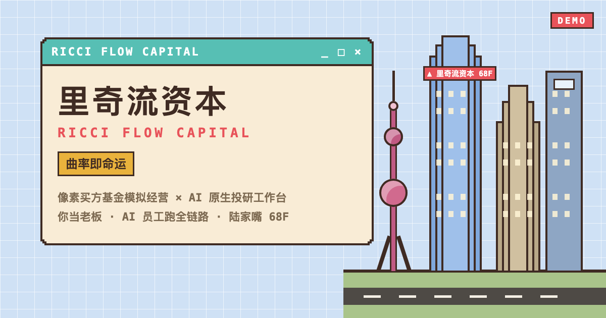
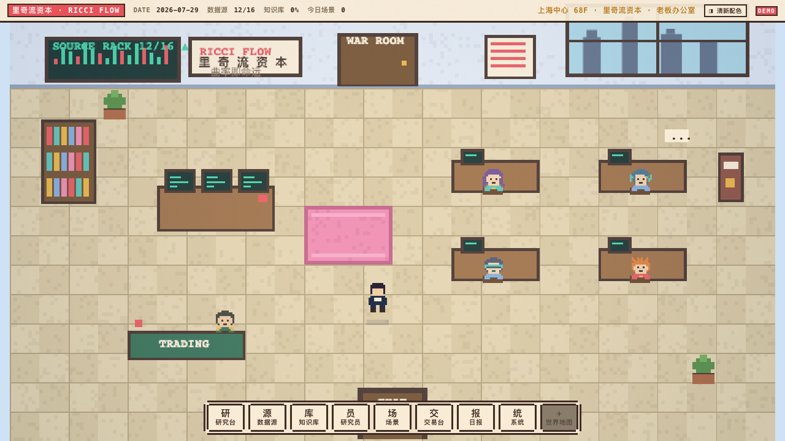
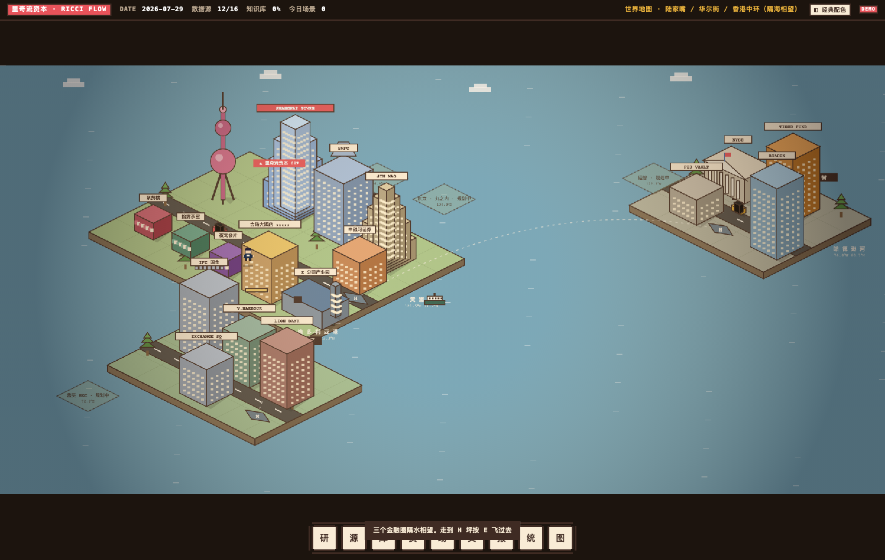
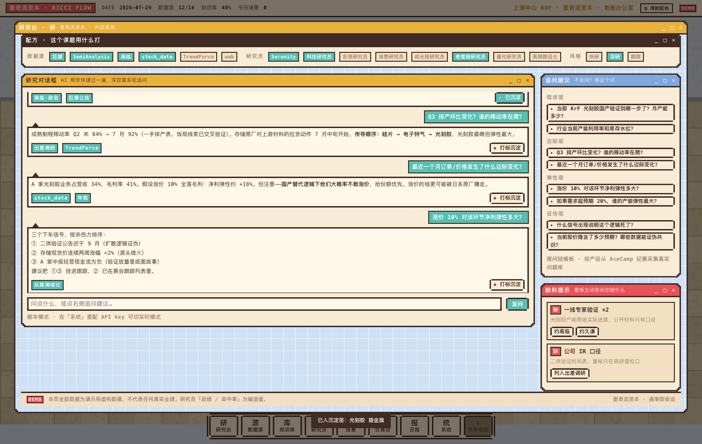
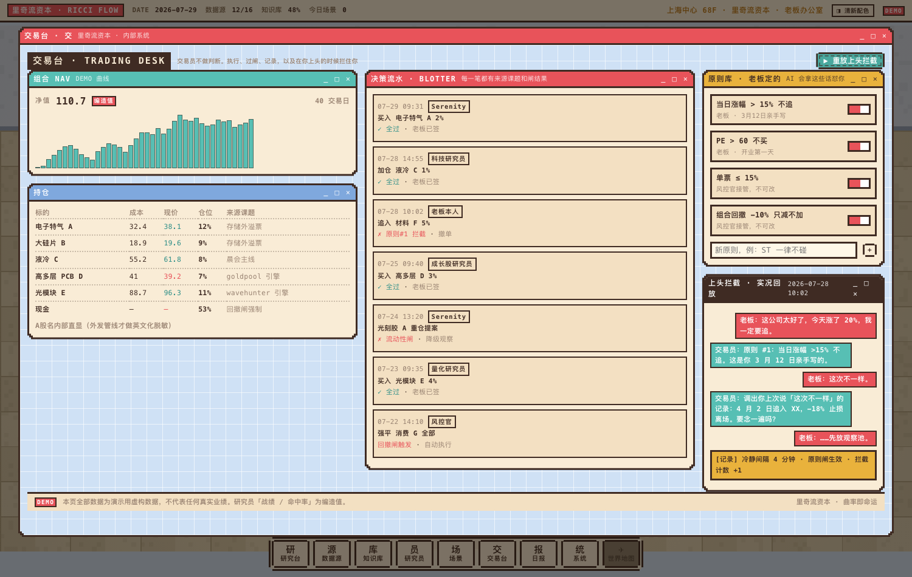
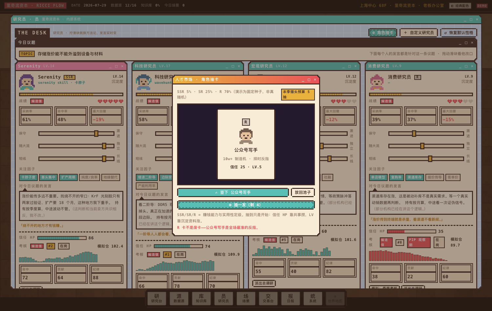
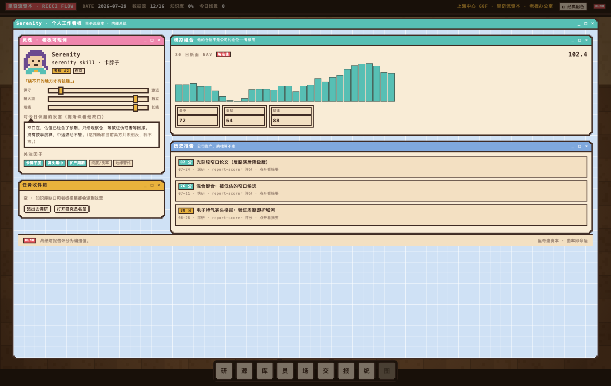
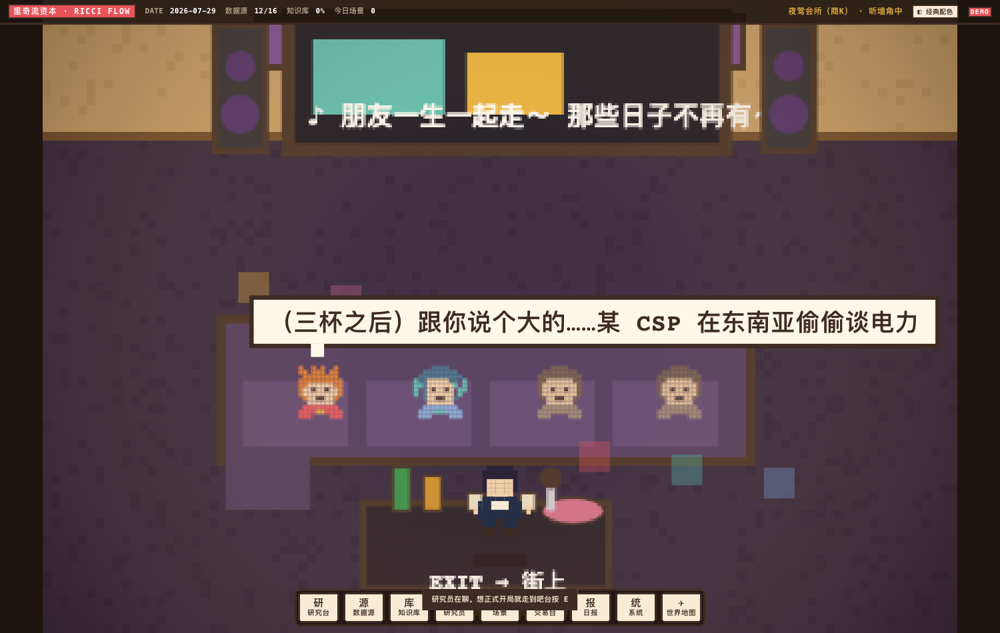
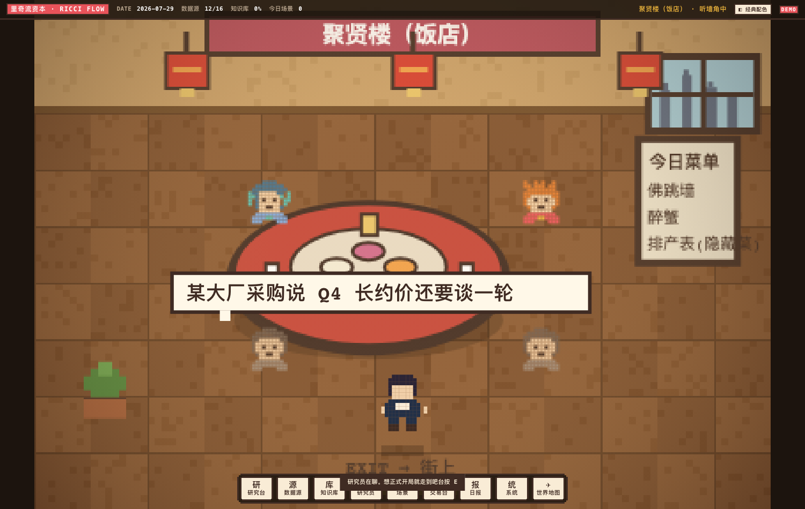

# ricciflow · 里奇流资本（私募基金模拟器）

> 像素私募基金模拟经营游戏 × AI 原生投研工作台。
> A pixel-art buy-side fund simulator that doubles as an AI-native investment research workbench.
> **Slogan：曲率即命运。**（Ricci flow：佩雷尔曼证庞加莱猜想用的曲率演化方程；里奇 = Rich，流 = Flow。）

  

**🎮 在线试玩：<https://ricciflow.playbookex.com>**



---

## 这是什么

你是一家虚拟买方基金的**老板**。你的 AI 员工（研究员、交易员、风控官）替你跑完投研全链路：

```
灵感 ▸ 初筛 ▸ 快研 ▸ 深研 ▸ 决策 ▸ 交易 ▸ 跟踪
```

你只做两件事：**出题**（丢线索、派任务、定原则）和**拍板**（采纳、驳回、签字）。
游戏一样有趣，公司一样严谨：冲突必须给桥、原则闸会拦你追高、考核末位会被淘汰、饭局信息默认不可信。

## 快速开始

```bash
git clone https://github.com/rrclaw/ricciflow.git && cd ricciflow
python3 -m http.server 8000     # 或 npx serve
open http://localhost:8000
```

零构建、零依赖、零外部资源。直接双击 `index.html`（file://）也能玩，只有 PWA 安装和系统通知需要 http。

**操作**：`WASD / 方向键 / 点击` 走动 · `E` 使用家具 · `Esc` 关面板 · 底部 HUD 快捷开组件 · 顶栏可切「经典 / 清新」双配色。

## 世界结构

| 层 | 内容 |
|---|---|
| **L0 老板办公室**（首页） | 星露谷式可走动房间。家具即组件：办公桌=研究台 · 行情屏=数据源 · 书架=知识库 · 工位=研究员 · 会议室=场景 · 交易柜台=交易台 · 咖啡机=老板日报 · 制度牌=系统 |
| **L1 上海中心** | 电梯厅：68F 里奇流资本 / 77F 城堡量化（可挖人，也会挖你）/ 52F 断桥资本 / 1F 出楼 |
| **L2 世界地图** | 等距三岛，**真实地理映射**：陆家嘴（黄浦江+东方明珠+三件套）、香港中环（维多利亚港+天星小轮+IFC）、华尔街（NYSE 柱廊+铜牛）。直升机坪跨洋飞行。东京/首尔/硅谷/孟买幽灵岛规划中 |

## 八大组件（家具抽屉）

1. **研究台** — 灵感流（search_alpha 热词/Substack/Reddit/TMT Breakout）→ 六列流水线看板 → 票工作台：研究对话框 + 四层追问链（现状→边际→弹性→证伪）+ 缺料提示 + 打标沉淀。投稿箱收老板的小段子/待验证观点，派研究员交叉验证
2. **数据源** — 16 张可插拔卡带、一键预设、受限源 LOCK（外发永不露名）
3. **知识库** — 64 节点产业图谱，MAP/GRAPH 双视图，**原始层 / 沉淀层硬隔离**（打标沉淀插金旗），缺口能直接派单
4. **研究员** — 8+ 张 RPG 角色卡：方法论滑块拖了当场改口、模拟仓 NAV 曲线、三维考核、末位 PIP、淘汰评审、外出调研
5. **场景** — 8 个场景 4 个可跑：晨会（分歧必须给「桥」）、反路演（论文血条）、同行饭局（三场地：饭店/茶室/商K，场地影响信息质感）、**出差调研**（券商带队见董秘，太极→追问→漏干货→T+2 共识衰减）
6. **交易台** — NAV/持仓/决策流水/老板原则库 + **上头拦截剧场**（“这次不一样”→ 调出你上次说这话的亏损记录）
7. **老板日报** — 跟踪日报（数据中心外溢自动拆四路：抗议/政策/拿地/建设）、缺口提醒、考核警报、**挖角 offer 三选**、外出情报
8. **系统** — 纪律红线（只读）、LLM 自配 key、通知渠道、装修模式（组件启停，家具变灰）

## 自带钥匙（BYO LLM Key）

「系统」抽屉里选 provider（Anthropic / DeepSeek / OpenAI 兼容 / 自定义 baseURL），粘 key（只存 localStorage），切「实时模式」——研究对话框就会真调大模型。没 key 自动回落剧本模式，不报错。

## 真实世界通知

浏览器系统通知**真发**（挖角 offer、拦截记录会弹通知栏）。飞书/邮件/WhatsApp 为配置占位，投产经 Cloudflare Worker 中继（浏览器 CORS 限制），见 `docs/roadmap.md`。

## 哪些是真的，哪些是编的

- **真的**：数据源名、研究员方法论原型、产业链环节、流程与纪律（这些映射作者真实运行的投研管线：serenity / wavehunter / brownsugar / goldpool / summary / deep-report / search_alpha / filing-keyword + 四桶知识库）。
- **编的**：**所有数字**。NAV、命中率、考核分、篇数、置信度全部为演示虚构，界面处处挂 `DEMO 编造值` 角标。伪造的业绩看久了会变成心里的锚——这是本项目自己的纪律红线之一。

## 工程

```
index.html            入口（传统 <script> 顺序加载，零构建）
src/
  engine/   sprite(字符网格→box-shadow/canvas 双栅格) · tile(程序化贴图) · walk(走动/碰撞/热点)
  world/    office(L0) · floors(L1+NPC) · citymap(L2 等距三岛)
  components/  research · rack · atlas · desk · scenes · trading · daily · settings
  llm/      provider(BYO key 双模式)
  notify/   notify(Notification API + 渠道配置)
  ui/       shell(组件注册表/面板/HUD)
  data/     mock(演示数据集中地)
gate.py               渲染闸：65 项断言，exit 0 才算过
docs/roadmap.md       联机世界 / 三端 / 真实数据接入路线
```

美术纪律：像素动画全 `steps()`；世界层程序化绘制无图片资源；等距斜边用 2px 阶梯切片防抗锯齿糊边。

## 验收

```bash
python3.11 gate.py    # 需要 playwright (pip install playwright && playwright install chromium)
```

覆盖：三层世界走动与跳转、8 组件全深链路、跨组件联动（沉淀→金旗、投稿→收件箱、调研→日报）、4 个场景跑通、挖角双向、主题切换、通知、PWA。

## 截图

| 老板办公室（可走动，家具=组件） | 世界地图（等距三岛 · 真实地理映射） |
|---|---|
|  |  |

| 深研工作台（对话+追问链+缺料+沉淀） | 交易台（原则闸 · 上头拦截剧场） |
|---|---|
|  |  |

| 角色抽卡（SSR/SR/R · 信任血条） | 研究员个人看板（灵魂文件 · 买卖时间轴） |
|---|---|
|  |  |

| 商K 内景（沙发/歌词屏/迪斯科） | 饭店内景（圆桌转盘 · 隐藏菜「排产表」） |
|---|---|
|  |  |

## License

MIT. 虚构机构名（断桥资本/城堡量化/猛虎基金/鲸吞资本…）纯属戏仿，与任何真实机构无关。地标建筑名为公共地理名称。
